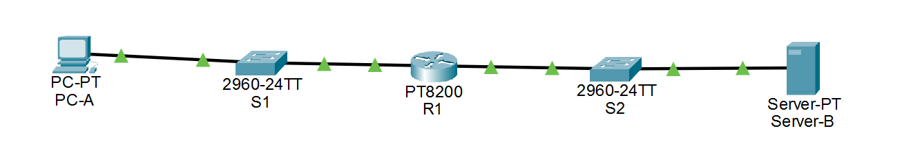
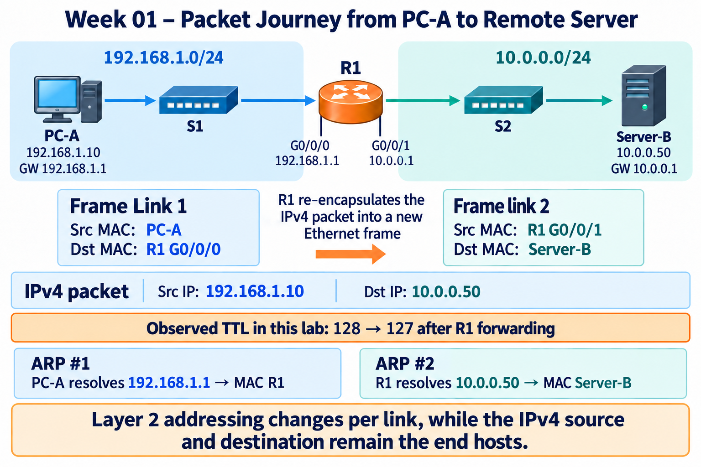

# Week 01 Lab — PC to Remote Server Packet Flow

[Week 01 overview](../README.md) · [Evidence index](../evidence/README.md)

This report documents the user's Week 01 exercise and supplied screenshots. Organizing this archive did not rerun the simulation.

## Objective

This lab was designed to verify how a host communicates with a destination on a remote IPv4 network.

The main objectives were to:

- determine whether a destination is local or remote,
- observe ARP resolution for the default gateway,
- verify Ethernet switch MAC learning,
- distinguish Layer 2 next-hop addressing from Layer 3 end-to-end addressing,
- observe router de-encapsulation and re-encapsulation,
- compare first and subsequent transmissions,
- test ARP state changes,
- and troubleshoot an intentionally incorrect default gateway.

The lab followed a:

> **predict → test → observe → troubleshoot → recover**

workflow.

---

## Scope

### Included

- IPv4 addressing
- Subnet mask interpretation
- Local vs. remote destination decision
- Default gateway behavior
- ARP Request and ARP Reply
- Ethernet source and destination MAC addresses
- Switch MAC learning and forwarding
- Basic router forwarding
- Layer 2 re-encapsulation
- ICMP Echo Request / Echo Reply
- ARP cache behavior
- Basic connectivity troubleshooting

### Not Included

- VLANs
- ACLs
- NAT
- Dynamic routing protocols
- Advanced subnetting
- Wireshark
- Production network troubleshooting

---

## Topology

```text
192.168.1.0/24                         10.0.0.0/24

PC-A -------- S1 -------- R1 -------- S2 -------- Server-B
                        G0/0/0
                        192.168.1.1

                        G0/0/1
                        10.0.0.1
```



### Addressing Table

| Device | Interface | IPv4 Address | Subnet Mask | Default Gateway |
|---|---|---:|---:|---:|
| PC-A | NIC | `192.168.1.10` | `255.255.255.0` | `192.168.1.1` |
| R1 | G0/0/0 | `192.168.1.1` | `255.255.255.0` | — |
| R1 | G0/0/1 | `10.0.0.1` | `255.255.255.0` | — |
| Server-B | NIC | `10.0.0.50` | `255.255.255.0` | `10.0.0.1` |

The Packet Tracer file is available as [`topology.pkt`](topology.pkt), renamed from the supplied `pc-to-default-gateway.pkt` without changing its contents.

---

## Packet Flow Diagram



The diagram summarizes the main forwarding behavior observed in the lab:

- PC-A sends the first Ethernet frame to R1, not directly to Server-B.
- R1 removes the incoming Layer 2 frame.
- R1 makes a forwarding decision using the destination IPv4 address.
- R1 creates a new Layer 2 frame for the second network.
- The Layer 2 addresses change between links.
- In this lab, without NAT, the source and destination IPv4 addresses remain the two end hosts.

Observed TTL behavior:

```text
PC-A sends packet: TTL 128
R1 forwards packet: TTL 127
```

---

# Initial Prediction

Before observing Packet Tracer Simulation Mode, I recorded the expected behavior.

## P1 — Destination Classification

Destination `10.0.0.50` should be treated as remote because PC-A is located in `192.168.1.0/24`, while Server-B is located in `10.0.0.0/24`.

**Expected:** PC-A sends the packet toward its default gateway.

---

## P2 — Next Hop

PC-A should use `192.168.1.1` as the first Layer 3 next hop.

Before sending the remote traffic, PC-A must know the MAC address associated with the gateway interface.

---

## P3 — ARP Target

If the gateway MAC address is not already cached, PC-A should perform ARP for:

```text
192.168.1.1
```

It should not ARP directly for `10.0.0.50`.

---

## P4 — ARP Request

Expected ARP Request:

```text
Source IP:      192.168.1.10
Target IP:      192.168.1.1
Source MAC:     PC-A MAC
Destination MAC: FF:FF:FF:FF:FF:FF
```

---

## P5 — Switch Behavior

S1 should:

1. learn PC-A's source MAC address on the incoming port,
2. identify the ARP Request as a broadcast,
3. flood the broadcast to the other relevant ports.

---

## P6 — Router ARP Reply

R1 should receive the ARP Request and recognize `192.168.1.1` as its own interface address.

R1 should send an ARP Reply containing its G0/0/0 MAC address.

S1 should then be able to learn R1's source MAC from the reply.

---

## P7 — PC-A ARP Cache

After receiving the ARP Reply, PC-A should store a mapping similar to:

```text
192.168.1.1 → R1 G0/0/0 MAC
```

---

## P8 — IPv4 Packet

The IP packet should contain:

```text
Source IP:      192.168.1.10
Destination IP: 10.0.0.50
```

The destination IP represents the final destination, not the default gateway.

---

## P9 — First Ethernet Frame

Expected Ethernet frame from PC-A:

```text
Source MAC:      PC-A MAC
Destination MAC: R1 G0/0/0 MAC

Payload:
IPv4 packet
Src IP = 192.168.1.10
Dst IP = 10.0.0.50
```

---

## P10 — Switch Forwarding

Because S1 should already have learned R1's MAC from the ARP Reply, the ICMP Ethernet frame should be forwarded directly toward R1.

If the destination MAC were unknown, the behavior would be unknown-unicast flooding rather than a broadcast frame.

---

## P11 — Router Reception

R1 should accept the Ethernet frame because the destination MAC is its own G0/0/0 MAC.

R1 should then process the embedded IPv4 packet.

---

## P12 — Remote Forwarding

R1 should:

1. remove the incoming Ethernet frame,
2. inspect destination IP `10.0.0.50`,
3. identify `10.0.0.0/24` as a directly connected network,
4. resolve Server-B's MAC if necessary,
5. create a new Ethernet frame on G0/0/1,
6. forward the packet toward Server-B.

---

# Baseline Verification

The first baseline test used:

```text
ping 10.0.0.50
```

Packet Tracer Simulation Mode was filtered primarily for:

```text
ARP
ICMP
```

---

## 1. PC-A ARPs for the Default Gateway

The first ARP Request observed contained:

```text
Ethernet
Source MAC:      00E0.F74C.8019
Destination MAC: FFFF.FFFF.FFFF
EtherType:       0x0806

ARP
Opcode:          0x0001
Source IP:       192.168.1.10
Target IP:       192.168.1.1
Target MAC:      0000.0000.0000
```

This verified that PC-A did not try to resolve Server-B's MAC directly.

Instead, it attempted to resolve the MAC address of the local default gateway.

Evidence:

[`arp-request-gateway.png`](../evidence/arp-request-gateway.png)

---

## 2. Switch MAC Learning

After the ARP exchange, the S1 MAC address table contained entries for both PC-A and R1.

Observed dynamic entries:

```text
0060.5c89.7001 → Fa0/1
00e0.f74c.8019 → Fa0/2
```

This demonstrated that S1 learned MAC addresses from the **source MAC address** of received Ethernet frames.

Evidence:

[`s1-mac-learning.png`](../evidence/s1-mac-learning.png)

---

## 3. Remote IP vs. Local Layer 2 Next Hop

The ICMP Echo Request leaving PC-A contained:

```text
Ethernet
Source MAC:      00E0.F74C.8019
Destination MAC: 0060.5C89.7001

IPv4
Source IP:       192.168.1.10
Destination IP:  10.0.0.50
TTL:             128
```

This verified an important distinction:

> The IPv4 destination identifies the final host, while the Ethernet destination identifies the next hop on the current local link.

Evidence:

[`remote-ip-local-next-hop.png`](../evidence/remote-ip-local-next-hop.png)

---

## 4. Router Processing

R1 received the Ethernet frame addressed to its G0/0/0 MAC.

The IPv4 packet inside the frame still contained:

```text
Src IP = 192.168.1.10
Dst IP = 10.0.0.50
```

R1 removed the incoming Layer 2 frame and performed routing based on the destination IPv4 address.

After forwarding, the TTL was observed as:

```text
127
```

This confirmed that the packet had crossed a router.

---

## 5. R1 Performs a New ARP on the Second Network

Before forwarding the packet to Server-B, R1 generated a new ARP Request on `10.0.0.0/24`.

Observed values:

```text
Source IP:       10.0.0.1
Target IP:       10.0.0.50
Source MAC:      0060.5C89.7002
Destination MAC: FFFF.FFFF.FFFF
```

This confirmed that the original ARP broadcast from PC-A was not forwarded by the router.

Instead, R1 originated a separate ARP process on its outgoing network.

Evidence:

[`r1-arp-server.png`](../evidence/r1-arp-server.png)

---

## 6. Server-B ARP Reply

Server-B replied with:

```text
Source IP:       10.0.0.50
Target IP:       10.0.0.1
Source MAC:      0040.0B6B.B222
Destination MAC: 0060.5C89.7002
```

R1 now had the Layer 2 destination information required to send the IPv4 packet to Server-B.

---

## 7. Router Re-encapsulation

R1 created a new Ethernet frame on the second network.

Observed frame:

```text
Ethernet
Source MAC:      0060.5C89.7002
Destination MAC: 0040.0B6B.B222

IPv4
Source IP:       192.168.1.10
Destination IP:  10.0.0.50
TTL:             127
```

This verified that:

- the Layer 2 source changed from PC-A to R1,
- the Layer 2 destination changed from R1 to Server-B,
- the IPv4 source and destination remained the two end hosts,
- the TTL decreased by one.

Evidence:

[`r1-reencapsulation.png`](../evidence/r1-reencapsulation.png)

---

# First vs. Subsequent Transmission

A second ping to:

```text
10.0.0.50
```

was performed without clearing the learned state.

## Prediction

The second communication should not require the same ARP resolution process if the necessary ARP entries are still valid.

Expected traffic:

```text
PC-A → S1 → R1 → S2 → Server-B
                 ICMP
```

without additional ARP Requests.

## Result

The Event List showed ICMP forwarding without the initial ARP sequence.

This demonstrated that previously learned ARP mappings could be reused while valid.

### Important Table Distinction

The lab reinforced that different devices maintain different forms of state:

```text
PC-A
ARP cache:
192.168.1.1 → R1 MAC

R1
ARP cache:
10.0.0.50 → Server-B MAC

Switches
MAC address table:
MAC → Switch Port
```

An ARP table is not the same as a switch MAC address table.

---

# ARP State Variation

To test state-dependent behavior, only PC-A's ARP cache was cleared.

## Prediction

Expected behavior:

1. PC-A should again ARP for `192.168.1.1`.
2. R1 should reply.
3. PC-A should then send ICMP traffic.
4. R1 should not need to repeat ARP for Server-B if its own ARP state is still valid.

## Result

Observed Event List:

```text
PC-A creates ICMP
PC-A creates ARP

PC-A → S1 ARP
S1 → R1 ARP
R1 → S1 ARP Reply
S1 → PC-A ARP Reply

PC-A → S1 ICMP
S1 → R1 ICMP
R1 → S2 ICMP
S2 → Server-B ICMP
```

No new R1-to-Server-B ARP Request was required.

This demonstrated that ARP state is maintained independently by each Layer 3 device.

It also showed that Packet Tracer may display the locally generated ICMP event before ARP resolution completes.

The packet can exist logically while waiting for the required Layer 2 next-hop information before transmission.

---

# Troubleshooting Test — Wrong Default Gateway

An intentional fault was introduced on PC-A.

Correct configuration:

```text
Default Gateway = 192.168.1.1
```

Faulty configuration:

```text
Default Gateway = 192.168.1.254
```

No device in the lab owned `192.168.1.254`.

---

## Initial Prediction

The initial prediction contained one important misconception.

I initially expected that the router might receive the remote traffic and reject it.

The test showed that the failure actually occurred earlier.

PC-A could not resolve the MAC address of the configured default gateway, so the remote Ethernet frame could not be sent toward R1.

---

# Troubleshooting Process

## Symptom

```text
Remote destination 10.0.0.50 could not be reached.
```

---

## Test 1 — Local Connectivity

PC-A tested:

```text
ping 192.168.1.1
```

### Expected

Because `192.168.1.1` is inside PC-A's local `/24` network, communication should not depend on the configured default gateway.

### Actual

The local ping succeeded.

### Interpretation

This reduced the likelihood of problems involving:

- PC-A NIC,
- physical/link connectivity,
- S1 forwarding,
- PC-A local IPv4 configuration,
- R1 G0/0/0 reachability.

It also demonstrated that an incorrect default gateway does not necessarily break communication with hosts in the same subnet.

---

## Test 2 — Remote Connectivity

PC-A then tested:

```text
ping 10.0.0.50
```

### Expected

PC-A should classify the destination as remote and attempt to use the configured gateway:

```text
192.168.1.254
```

### Actual

Packet Tracer showed repeated ARP Requests for:

```text
Target IP = 192.168.1.254
```

Observed ARP:

```text
Source IP:       192.168.1.10
Target IP:       192.168.1.254
Destination MAC: FFFF.FFFF.FFFF
Opcode:          ARP Request
```

No ARP Reply was received.

Evidence:

[`wrong-gateway-failure.png`](../evidence/wrong-gateway-failure.png)

[Repeated ARP and failed ICMP event list](../evidence/wrong-gateway-event-list.png)

---

## Root Cause

The root cause was:

```text
Incorrect default gateway configuration
```

PC-A was configured with:

```text
192.168.1.254
```

instead of:

```text
192.168.1.1
```

Because PC-A could not resolve a MAC address for the nonexistent gateway, the remote ICMP traffic could not be transmitted toward R1.

The failure occurred before normal router forwarding.

---

# Recovery

The configuration was corrected:

```text
192.168.1.254
        ↓
192.168.1.1
```

PC-A's ARP state was cleared and remote connectivity was tested again.

Command:

```text
ping 10.0.0.50
```

## Recovery Result

The Event List showed:

```text
PC-A ARP
PC-A → S1
S1 → R1
R1 → S1 ARP Reply
S1 → PC-A

PC-A → S1 ICMP
S1 → R1 ICMP
R1 → S2 ICMP
S2 → Server-B ICMP

Server-B → S2 ICMP Reply
S2 → R1
R1 → S1
S1 → PC-A
```

Remote communication was successfully restored.

Evidence:

[`recovery-verification.png`](../evidence/recovery-verification.png)

---

# Validation Summary

| Test | Prediction | Actual Result | Status |
|---|---|---|---|
| Baseline remote communication | PC-A ARPs for R1 before sending remote traffic | Gateway ARP occurred before ICMP | Pass |
| Switch learning | S1 learns source MAC addresses | PC-A and R1 appeared as dynamic MAC entries | Pass |
| Layer 2 / Layer 3 addressing | Dst IP remains Server-B while first Dst MAC is R1 | Observed exactly as predicted | Pass |
| Router forwarding | R1 re-encapsulates the packet with new MAC addresses | New Ethernet frame observed on second network | Pass |
| Subsequent communication | Valid ARP state removes repeated ARP requirement | ICMP proceeded without additional ARP | Pass |
| PC-A ARP cache cleared | Only PC-A repeats gateway resolution | PC-A ARPed again while R1 retained Server-B state | Pass |
| Wrong default gateway | Local works, remote fails | Local R1 reachable; remote ARP failed | Pass |
| Recovery | Correct gateway restores connectivity | End-to-end ICMP restored | Pass |

---

# Key Technical Findings

## 1. Destination IP and Destination MAC Serve Different Purposes

For remote traffic:

```text
Destination IP  = final destination
Destination MAC = next hop on current Ethernet link
```

---

## 2. ARP Is Local to a Broadcast Domain

PC-A used ARP to discover R1's MAC.

R1 later used a separate ARP process to discover Server-B's MAC.

The router did not forward PC-A's original Ethernet broadcast.

---

## 3. Switch Learning and ARP Are Different Processes

A switch learns:

```text
Source MAC → Port
```

ARP resolves:

```text
IPv4 address → MAC address
```

These are related to Layer 2 forwarding but are not the same mechanism.

---

## 4. Routers Replace Layer 2 Frames

R1 did not simply forward the original Ethernet frame unchanged.

It:

```text
receives frame
↓
removes Layer 2 header/trailer
↓
examines destination IP
↓
makes routing decision
↓
resolves next-hop MAC if required
↓
creates a new Layer 2 frame
↓
forwards packet
```

---

## 5. ARP State Exists Per Device

Clearing PC-A's ARP cache did not clear R1's ARP cache.

The experiment demonstrated that each device maintains its own local state.

---

## 6. Local Success Does Not Prove Remote Connectivity

During the wrong-gateway fault:

```text
Local communication = working
Remote communication = failing
```

This helped isolate the problem toward gateway / Layer 3 next-hop configuration rather than immediately blaming Layer 1 or Layer 2.

---

# Corrections from the Exercise

Several misconceptions were corrected during the lab.

### Before

A switch was partially associated with ARP resolution.

### Corrected

The switch learns MAC addresses from the **source MAC field of Ethernet frames**.

ARP is performed by hosts or Layer 3 interfaces to resolve IPv4 addresses to MAC addresses.

---

### Before

A remote ARP process was partially thought of as discovering the remote server directly from PC-A.

### Corrected

PC-A only needs the MAC address of its local default gateway.

R1 performs another local ARP process on the second network.

---

### Before

The wrong-gateway failure was initially expected to reach R1 and then be dropped.

### Corrected

PC-A first attempts to resolve the configured gateway MAC.

Because `192.168.1.254` does not exist, no ARP Reply is received and the remote Ethernet transmission cannot proceed.

---

# How to Reproduce

## Requirements

- Cisco Packet Tracer
- Topology file: [`topology.pkt`](topology.pkt)

## Baseline Test

1. Open the Packet Tracer topology.
2. Verify PC-A configuration:
   ```text
   192.168.1.10/24
   Gateway 192.168.1.1
   ```
3. Verify Server-B:
   ```text
   10.0.0.50/24
   Gateway 10.0.0.1
   ```
4. Enter Simulation Mode.
5. Enable ARP and ICMP filters.
6. From PC-A run:
   ```text
   ping 10.0.0.50
   ```
7. Observe:
   - ARP Request for `192.168.1.1`
   - ARP Reply from R1
   - ICMP frame from PC-A to R1
   - R1 ARP for `10.0.0.50`
   - new Ethernet frame from R1 to Server-B
   - ICMP Echo Reply returning to PC-A

## State Variation

1. Clear only PC-A's ARP cache.
2. Repeat:
   ```text
   ping 10.0.0.50
   ```
3. Observe PC-A repeating gateway ARP while R1 can continue using its existing Server-B mapping.

## Fault Test

1. Change PC-A default gateway to:
   ```text
   192.168.1.254
   ```
2. Test local connectivity:
   ```text
   ping 192.168.1.1
   ```
3. Test remote connectivity:
   ```text
   ping 10.0.0.50
   ```
4. Observe repeated ARP Requests for `192.168.1.254`.

## Recovery Test

1. Restore:
   ```text
   Default Gateway = 192.168.1.1
   ```
2. Clear PC-A ARP state.
3. Repeat:
   ```text
   ping 10.0.0.50
   ```
4. Confirm end-to-end connectivity is restored.

---

# Conclusion

The lab verified the packet journey from a host on one IPv4 network to a server on another network.

The most important result was understanding that remote communication requires cooperation between several independent mechanisms:

```text
IP destination decision
↓
ARP next-hop resolution
↓
Ethernet switching
↓
router Layer 3 forwarding
↓
new Layer 2 encapsulation
↓
delivery on the next network
```

The troubleshooting exercise also demonstrated why successful local communication and failed remote communication can indicate a default-gateway or routing-related problem rather than a complete network failure.

The lab provided practical verification of the networking concepts studied during Week 01 rather than relying only on theoretical recall.
